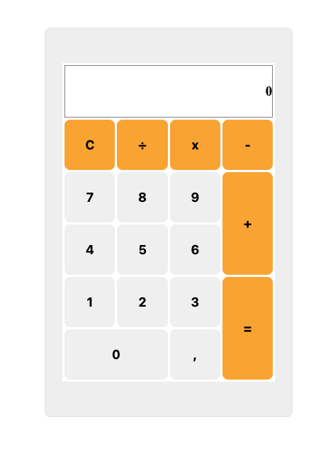

# Calculator

A simple calculator built with HTML, CSS, and JavaScript as part of [The Odin Project](https://www.theodinproject.com/lessons/foundations-calculator) Foundations curriculum.

## Preview

## Features

- Basic arithmetic operations: addition, subtraction, multiplication, division
- Decimal number support
- Chained calculations (e.g. `12 + 7 - 1 = 18`)
- Keyboard support
- Division by zero error handling
- Input validation (prevents NaN, premature evaluation)
- Clear button

## Keyboard Shortcuts

| Key             | Action        |
| --------------- | ------------- |
| `0-9`           | Number input  |
| `.`             | Decimal point |
| `+` `-` `*` `/` | Operators     |
| `Enter` or `=`  | Calculate     |
| `Escape`        | Clear         |

## Live Demo

[View on GitHub Pages](https://arifmertmisir.github.io/calculator)

## Built With

- HTML
- CSS
- Vanilla JavaScript
